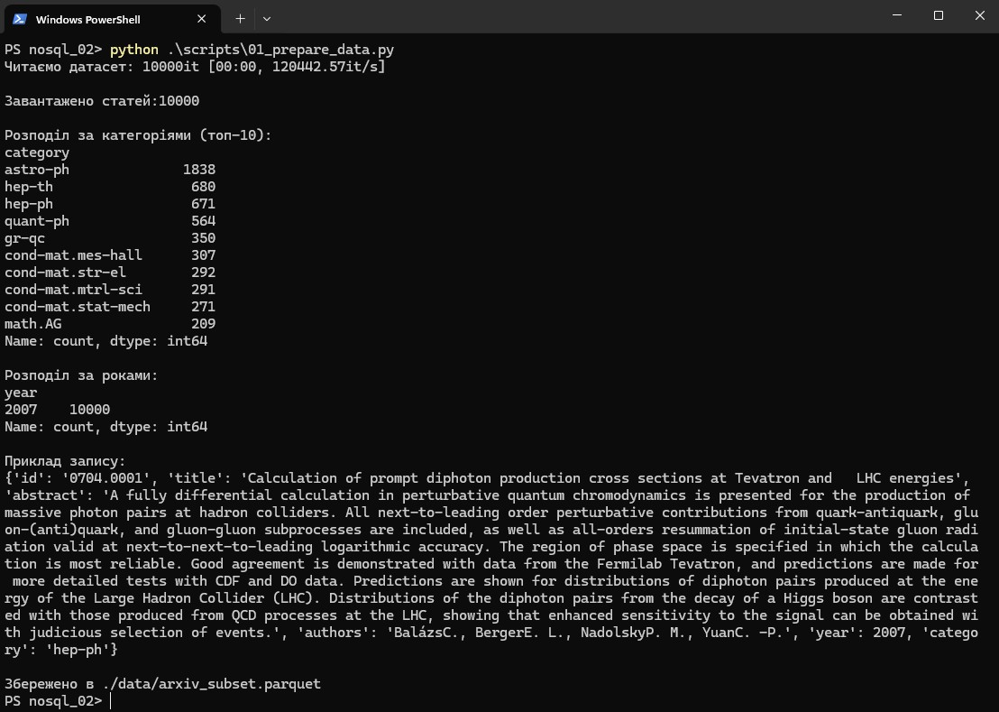
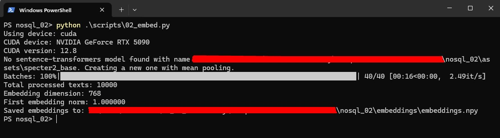
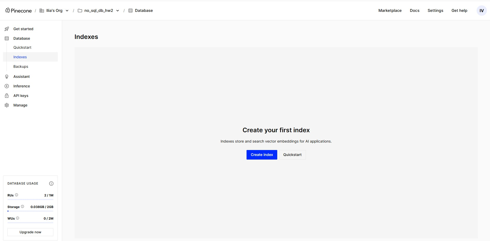
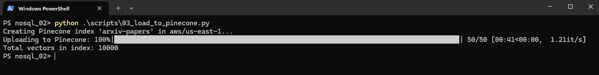
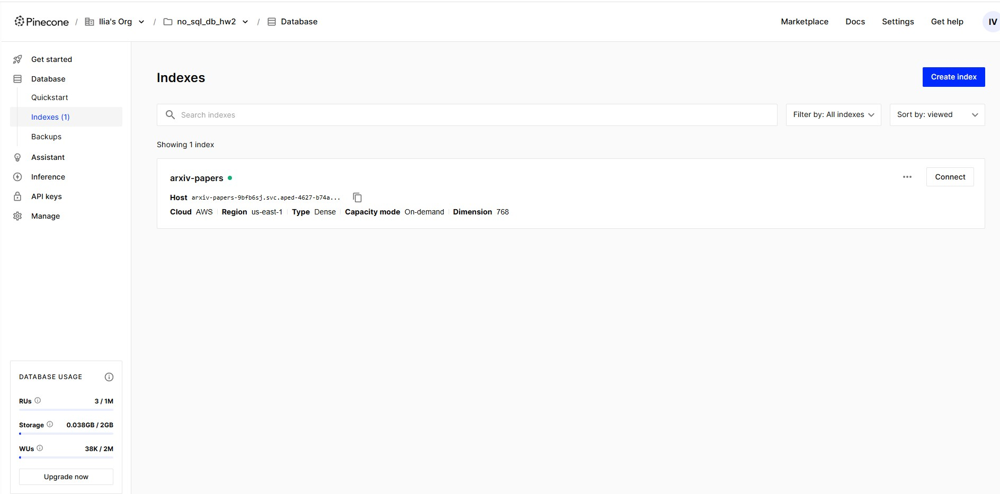
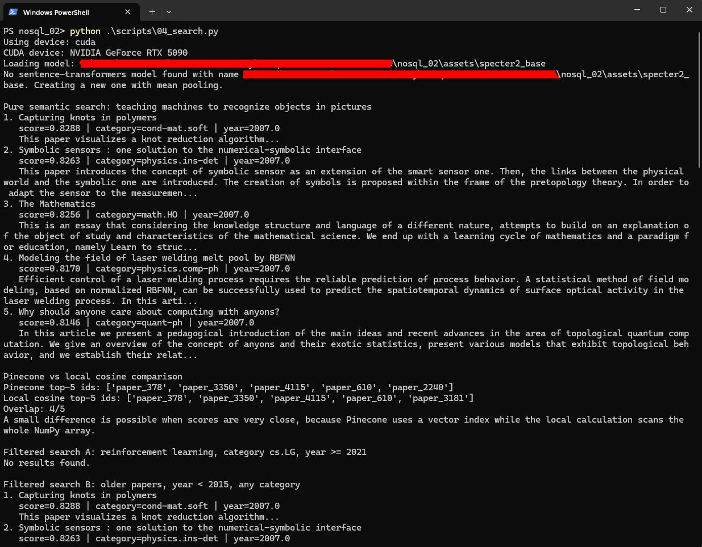
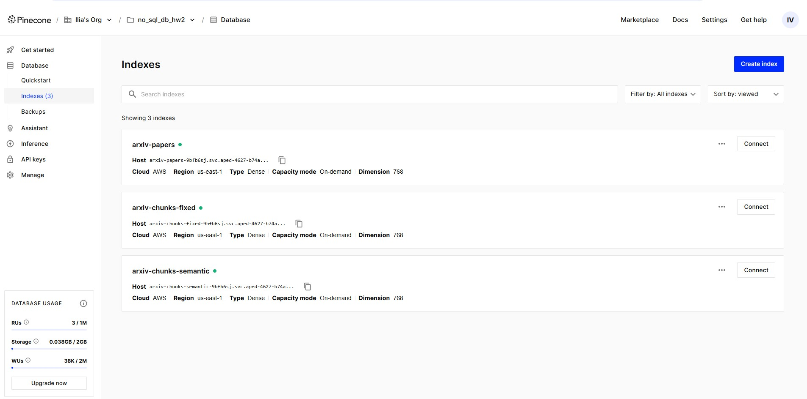
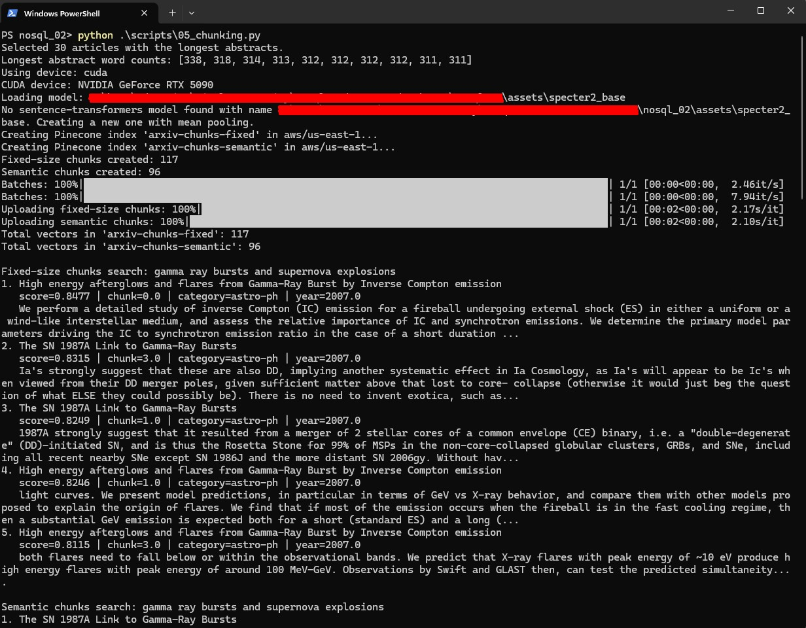
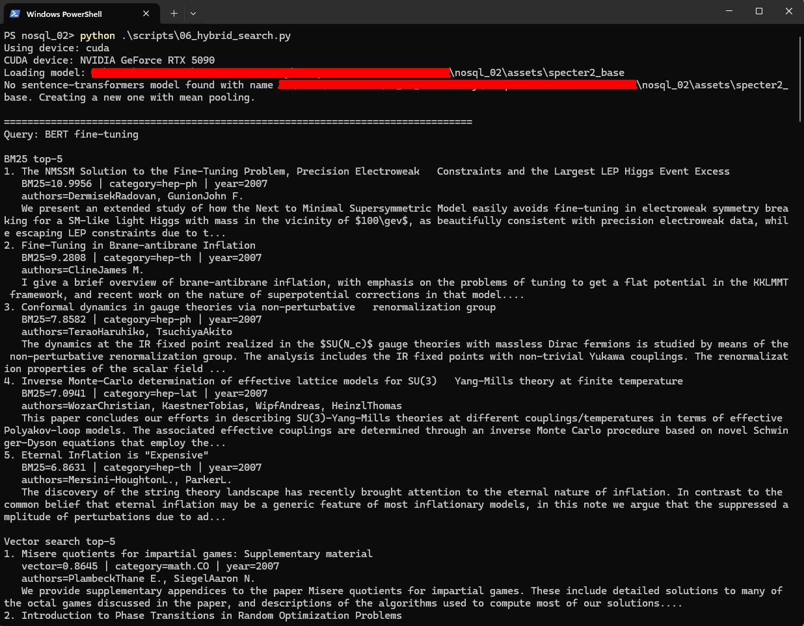

# NoSQL_02 vector databases

## Короткий підсумок

Використано підмножину arXiv на 10 000 статей, згенеровано 768-вимірні нормалізовані ембеддинги моделлю `allenai/specter2_base`, завантажено їх до Pinecone-індексу `arxiv-papers`, виконано семантичний пошук, фільтрований пошук, локальне порівняння метрик, chunking двома стратегіями та гібридний пошук BM25 + vector через Reciprocal Rank Fusion.

Основні артефакти:

| Артефакт | Значення |
|---|---:|
| Підготовлений датасет | `data/arxiv_subset.parquet`, 10 000 статей |
| Ембеддинги | `embeddings/embeddings.npy`, shape `10000 x 768` |
| Основний індекс | `arxiv-papers`, metric `cosine`, 10 000 vectors |
| Chunk indexes | `arxiv-chunks-fixed` = 117 vectors, `arxiv-chunks-semantic` = 96 vectors |
| Повні логи | `results/*_result.txt` |
| Скріншоти запусків | `results/*_result.jpg`, `results/*pinecone*.jpg` |

## Частина 1. Дані, інструменти, ембеддинги

### 1.1. Підготовка датасету

Скрипт `scripts/01_prepare_data.py` прочитав arXiv JSONL, відібрав перші 10 000 записів, очистив поля `title`, `abstract`, `authors`, виділив `year` і основну `category`, після чого зберіг результат у `data/arxiv_subset.parquet`. У вибірці всі записи мають `year = 2007`, що важливо для подальших фільтрів за роком.

Найбільші категорії у вибірці: `astro-ph` - 1838 статей, `hep-th` - 680, `hep-ph` - 671, `quant-ph` - 564. Приклад першого запису: `0704.0001`, категорія `hep-ph`, назва `Calculation of prompt diphoton production cross sections at Tevatron and LHC energies`.

### 1.2. Вибір Pinecone, Qdrant, Chroma

Pinecone відрізняється тим, що це керована комерційна векторна база: інфраструктура, масштабування, API gateway, control plane/data plane і зберігання обслуговуються постачальником. За ліцензією це не open-source рушій для самостійної модифікації, а proprietary SaaS/BYOC-продукт з API-доступом. За продуктивністю Pinecone орієнтований на production-навантаження: serverless storage, окреме масштабування read/write path, metadata filtering і керовані квоти. У цьому завданні це зручно, бо не треба підіймати власний кластер, достатньо API-ключа й serverless-індексу. Pinecone варто обрати для production/RAG-систем, де важливі SLA, менше операційної роботи, швидкий старт, метрики, квоти та масштабування без ручного адміністрування.

Qdrant є open-source системою з ліцензією Apache 2.0, написаною на Rust, доступною як self-hosted server і як Qdrant Cloud. За моделлю розгортання він гнучкіший: можна запустити локально в Docker, у власному Kubernetes або взяти managed cloud. За продуктивністю Qdrant сильний для payload filtering, HNSW-пошуку, quantization, sharding/replication і високого навантаження за умови правильного sizing власної інфраструктури. Його варто обирати, коли потрібен контроль над інфраструктурою, локальне або приватне розгортання, сильна фільтрація payload, гібридний пошук і можливість тонко керувати ресурсами.

Chroma також open-source під Apache 2.0 і дуже проста для локальних RAG-прототипів: її можна запускати in-memory, з persistence або в client-server режимі. За продуктивністю Chroma зазвичай виграє у швидкості розробки, а не в максимальному масштабі self-hosted production-кластера: API мінімальний, запуск простий, але для дуже великих корпусів і суворих latency/SLA я б спершу оцінював Pinecone або Qdrant. Я б обрав Chroma для ноутбуків, навчальних проєктів, швидких PoC і невеликих локальних агентів, де важливі простота API й мінімум налаштувань. Для керованих сценаріїв існує Chroma Cloud, але в навчальній роботі Chroma найцінніша саме як проста локальна база.

### 1.3. Чому `allenai/specter2_base`, а не `all-MiniLM-L6-v2`

Для пошуку за науковими текстами обрана SPECTER2-модель, бо вона навчалась саме на наукових публікаціях і зв'язках між ними. Картка Hugging Face описує SPECTER2 як модель для "scientific tasks" і вказує, що за комбінацією title + abstract або коротким query вона генерує ембеддинги для downstream applications. Це ближче до arXiv-пошуку, ніж `all-MiniLM-L6-v2`, яка є універсальною sentence-transformer моделлю для загальних речень і не спеціалізована на цитуваннях, науковій термінології та paper-level retrieval.

У картці `allenai/specter2_base` зазначено, що SPECTER2 навчена на понад 6M citation triplets, а task formats включають `Classification`, `Regression`, `Proximity (Retrieval)` і `Adhoc Search`. Саме `Proximity (Retrieval)` та `Adhoc Search` відповідають нашому сценарію: знайти наукові статті за коротким запитом або за змістовно близькою статтею. Крім того, SPECTER2 побудована на `allenai/scibert`, що краще відповідає науковій лексиці, ніж загальна компактна MiniLM-модель.

### 1.4. Рекомендована метрика схожості

У самій картці `allenai/specter2_base` немає окремого поля на кшталт `similarity_fn_name`, але вона позиціонує модель для retrieval/search, а SPECTER-підхід у наукових рекомендаціях використовує cosine similarity для ембеддингів. У цій роботі ембеддинги явно нормалізуються через `normalize_embeddings=True`, а Pinecone-індекси створені з `metric = "cosine"`. Це важливо, бо метрика є частиною індексу: якщо створити індекс з іншою геометрією, база буде оптимізувати інший критерій близькості, а ранжування та інтерпретація score можуть змінитися.

### 1.5. Чому cosine дорівнює dot product для нормалізованих ембеддингів

Косинусна схожість визначається як `cos(a, b) = (a * b) / (||a|| ||b||)`. Якщо ембеддинги нормалізовані до одиничної довжини, тобто `||a|| = 1` і `||b|| = 1`, знаменник дорівнює `1`, тому `cos(a, b) = a * b`. Отже, для одиничних векторів cosine similarity і dot product дають однакові значення та однакове ранжування.

## Частина 2. Завантаження у Pinecone і метадані

Скрипт `scripts/03_load_to_pinecone.py` створює індекс `arxiv-papers`, якщо він відсутній, з параметрами `dimension = 768`, `metric = "cosine"`, `cloud = aws`, `region = us-east-1`. Далі він читає `data/arxiv_subset.parquet` і `embeddings/embeddings.npy`, перевіряє відповідність кількості рядків і розмірності, формує записи `paper_<number>` та завантажує їх батчами по 200.

Метадані включають `arxiv_id`, `title`, `abstract`, `authors`, `year`, `category`. Поля обрізаються: `abstract` до 500 символів, `authors` до 200, `title` до 500. Це зроблено через обмеження Pinecone на сумарний розмір metadata одного запису, яке в документації вказане як 40 KB. Повний текст анотації лишається у parquet-файлі, а Pinecone зберігає достатньо metadata для швидкого показу результату та фільтрації.

Результат завантаження: `Total vectors in index: 10000`.

## Частина 3. Пошукові запити

### 3.1. Чистий семантичний пошук і фільтри

Для запиту `teaching machines to recognize objects in pictures` Pinecone повернув top-5: `Capturing knots in polymers`, `Symbolic sensors : one solution to the numerical-symbolic interface`, `The Mathematics`, `Modeling the field of laser welding melt pool by RBFNN`, `Why should anyone care about computing with anyons?`. Видача не ідеальна тематично, але це очікувано для маленької вибірки 2007 року, де немає сучасного computer vision корпусу. Порівняння Pinecone з локальним повним cosine scan дало overlap `4/5`, тобто основне ранжування збігається.

Фільтр A для `reinforcement learning`, `category = cs.LG`, `year >= 2021` не повернув результатів, бо локально в датасеті 0 таких рядків: уся підмножина має `year = 2007`. Фільтр B `year < 2015` повернув ті самі або дуже близькі результати, бо він фактично охоплює всі 10 000 записів. Це демонструє, що metadata-фільтри працюють, але якість і наявність результатів повністю залежать від покриття датасету.

### 3.2. Cosine, dot product і L2

Локальне порівняння показало однаковий top-5 для cosine similarity, dot product і L2-distance: `Capturing knots in polymers`, `Symbolic sensors`, `The Mathematics`, `Modeling the field of laser welding melt pool by RBFNN`, `Python for Education: Computational Methods for Nonlinear Systems`. Cosine і dot product збігаються, бо і ембеддинги, і query-вектор нормалізовані.

L2 у цьому запуску також дає той самий top-5, але score інтерпретується навпаки: менше значення означає ближчий вектор. Для одиничних векторів `||a - b||^2 = ||a||^2 + ||b||^2 - 2a*b = 2 - 2cos(a,b)`, тому мінімізація L2 еквівалентна максимізації cosine. Якби ембеддинги не були нормалізовані, dot product почав би залежати від довжини векторів, L2 також карав би різницю magnitude, а cosine залишався б мірою напрямку. Тоді top-5 могли б розійтися.

## Частина 4. Chunking

Скрипт `scripts/05_chunking.py` вибрав 30 статей з найдовшими анотаціями. Максимальні довжини у словах: `338`, `318`, `314`, `313`, `312`, далі кілька по `311-312`. Для fixed-size strategy використовувались чанки по 120 слів з overlap 30 слів; для semantic strategy речення групувалися до максимуму 120 слів без розриву речень, якщо окреме речення не перевищує ліміт.

Fixed-size chunking створив 117 чанків, semantic chunking - 96. Semantic strategy дає більш осмислені чанки, бо межі чанків збігаються з межами речень і зберігають завершені твердження. Це видно в результатах: semantic-видача для `gamma ray bursts and supernova explosions` повернула короткий цілісний фрагмент про GRBs, тоді як fixed-size часто починає або завершує текст посеред думки.

Випадки розрізаних речень є у fixed-size chunking: наприклад, один fixed chunk для `The SN 1987A Link to Gamma-Ray Bursts` починається з `Ia's strongly suggest...`, тобто контекст до початку речення вже втрачено. Це погіршує ембеддинг, бо модель бачить неповний семантичний фрагмент. Overlap частково компенсує проблему: слова на межі чанків дублюються, тому шанс зберегти локальний контекст зростає, але кількість чанків, вартість індексації та обсяг Pinecone-векторів також зростають.

## Частина 5. Гібридний пошук BM25 + vector + RRF

### 5.1. Порівняльна таблиця: три запити x три методи

| Запит | BM25 top-1 | Vector top-1 | Hybrid RRF top-1 |
|---|---|---|---|
| `BERT fine-tuning` | `The NMSSM Solution to the Fine-Tuning Problem...` | `Misere quotients for impartial games...` | `Fine-Tuning in Brane-antibrane Inflation` |
| `Yann LeCun convolutional networks` | `On Punctured Pragmatic Space-Time Codes...` | `Multilayer Perceptron with Functional Inputs...` | `Optimization in Gradient Networks` |
| `making computers understand human emotions from text` | `An Automated Evaluation Metric for Chinese Text Entry` | `Opinion Dynamics and Sociophysics` | `On the Development of Text Input Method - Lessons Learned` |

У запиті `BERT fine-tuning` BM25 краще зловив точний термін `fine-tuning`, але корпус 2007 року не містить BERT у сучасному значенні, тому результати зміщені в physics papers із фразою fine-tuning. Vector search для цього запиту дав слабшу видачу, бо семантика BERT-пошуку не представлена в корпусі. Hybrid RRF підняв документ `Fine-Tuning in Brane-antibrane Inflation`, який мав BM25 rank 2 і vector rank 34, тобто отримав сигнал з обох списків.

Для `Yann LeCun convolutional networks` жоден метод не знайшов самого LeCun у top-5, що знову пояснюється складом маленької вибірки. BM25 зачепив точний токен `convolutional`, vector search підняв neural-network-подібні теми, а RRF вибрав документи про networks, які мали ненульові позиції в обох ранжуваннях. Для перефразування `making computers understand human emotions from text` hybrid дав найстабільніший результат: `On the Development of Text Input Method` мав BM25 rank 3 і vector rank 2, тому RRF об'єднав точний lexical сигнал `text` із семантичним сигналом про language/input methods.

### 5.2. Який метод кращий і чому

Немає одного методу, який виграє завжди. BM25 краще працював там, де в запиті були точні терміни або імена: `fine-tuning`, `convolutional`, `text`. Vector search краще підходить для перефразувань і концептуальних запитів, але його якість просідає, якщо потрібної теми майже немає в корпусі або модель погано пов'язує короткий query з документами. Hybrid RRF у цій роботі є найкращим практичним компромісом: він не потребує калібрування BM25-score і vector-score в одну шкалу, але піднімає документи, які добре ранжуються хоча б одним методом, особливо якщо вони присутні в обох списках.

### 5.3. Документи в hybrid top-5, яких немає в top-5 окремих методів

Такі документи є, бо RRF об'єднував top-50 BM25 і top-50 vector, а не тільки top-5. Наприклад, для `BERT fine-tuning` документ `A Practical Seedless Infrared Safe Cone Algorithm` став hybrid rank 2, хоча мав BM25 rank 49 і vector rank 23. Для `Yann LeCun convolutional networks` документи `DIA-MCIS...` і `Extracting the hierarchical organization of complex systems` також не були в top-5 жодного окремого методу, але мали помірні позиції в обох списках. Це нормальна властивість RRF: два середні сигнали можуть разом переважити один дуже сильний сигнал лише з одного методу.

### 5.4. Вплив параметра `k` в RRF

RRF-score рахується як `sum(1 / (k + rank))`. При `k = 60` різниця між rank 1 і rank 30 згладжена, тому метод більше цінує узгодженість між BM25 і vector search. При `k = 1` верхні позиції стають набагато сильнішими: rank 1 дає `1/2`, а rank 30 лише `1/31`, тому результат сильніше повторює top окремого методу. Для production-пошуку `k = 60` часто стабільніший, а `k = 1` корисний, коли є довіра до top-rank сигналів і треба агресивно просувати перші позиції.

## Частина 6. Аналіз і висновки

### 6.1. Семантичний пошук vs BM25

BM25 варто використовувати для точних термінів, формулювань, абревіатур, назв методів, імен авторів і rare tokens. У цій роботі це видно на `BERT fine-tuning`: хоча BERT відсутній у датасеті 2007 року, BM25 коректно знайшов документи з точним `fine-tuning`. Аналогічно, для `Yann LeCun convolutional networks` BM25 хоча б зачепив слово `convolutional`, тоді як vector search пішов у ширші neural/network асоціації.

Семантичний пошук варто обирати для перефразувань, широких концептів і запитів, де користувач не знає точних термінів документа. Запит `making computers understand human emotions from text` не є назвою методу, тому vector search знайшов ближчі за змістом соціально-комунікаційні й language-oriented роботи, а hybrid підняв документ, який був сильним одночасно для lexical і semantic сигналів. Загальне правило: BM25 для exact-match precision, vector search для conceptual recall, hybrid для реальних пошукових інтерфейсів, де користувачі змішують обидва типи запитів.

### 6.2. Вплив розміру чанка

Якщо chunk занадто малий, наприклад 10-15 слів, він часто не містить повної думки: модель отримує фрагмент без контексту, а пошук стає шумним, бо багато чанків мають схожі загальні слова. Якщо chunk занадто великий, наприклад 500+ слів, він може містити кілька різних тем, і один ембеддинг усереднює занадто багато сигналів. Тоді релевантний абзац губиться всередині великого вектора, а score стає менш точним.

Оптимальний розмір залежить від задачі й моделі. Для коротких arXiv abstracts у цій роботі 120 слів виглядає адекватно: достатньо контексту для наукового твердження, але не надто багато змішаних тем. Для PDF або книжок я б підбирав chunk size експериментально, вимірюючи retrieval quality на контрольних запитах, і майже завжди додавав overlap або semantic sentence-aware splitting.

### 6.3. Невідповідна метрика

Якби Pinecone-індекс створили з `euclidean`, але всі ембеддинги залишилися нормалізованими, ранжування було б майже еквівалентне cosine: для одиничних `a` і `b` маємо `||a - b||^2 = ||a||^2 + ||b||^2 - 2a*b = 2 - 2cos(a,b)`. Тому менша L2-distance відповідає більшій cosine similarity. У цьому конкретному випадку катастрофи не було б, але score мав би іншу шкалу, а ANN-індекс оптимізував би іншу формулу.

Проблема стала б серйознішою, якби ембеддинги не були нормалізовані. Тоді L2 враховував би і напрямок, і довжину векторів, dot product міг би завищувати довгі вектори, а cosine ігнорував би magnitude. Тому метрика індексу має відповідати тому, як модель навчалась і як ембеддинги нормалізуються в pipeline.

### 6.4. Обмеження Pinecone Starter і масштабування до 10M статей

У цьому завданні обсяг маленький: 10 000 paper-векторів і менше 250 chunk-векторів. Потенційні обмеження Starter/free-tier: кількість індексів, storage/read/write quotas, регіони, support, SLA, а також 40 KB metadata per record. Через metadata limit abstract було обрізано до 500 символів, а повний текст залишено в parquet.

Для 10 мільйонів статей я б не завантажував усе як один навчальний proof-of-concept індекс. Потрібна окрема production-архітектура: batch/import pipeline, durable object storage для повних документів, metadata store або lakehouse, namespace/sharding за роками чи доменами, інкрементальні upsert/delete, моніторинг recall/latency/cost, hybrid sparse+dense search і reranking для top-N. Також варто оцінити quantization, dedicated read nodes або self-hosted Qdrant/інший кластер, якщо контроль вартості важливіший за повністю керований сервіс.

## Вивід скриптів і скріншоти

### `scripts/01_prepare_data.py`

Повний лог: [results/01_prepare_data_result.txt](results/01_prepare_data_result.txt)



```text
Завантажено статей:10000
Розподіл за категоріями (топ-10):
astro-ph 1838
hep-th    680
hep-ph    671
quant-ph 564
Розподіл за роками:
2007 10000
Збережено в ./data/arxiv_subset.parquet
```

### `scripts/02_embed.py`

Повний лог: [results/02_embed_result.txt](results/02_embed_result.txt)



```text
Using device: cuda
CUDA device: NVIDIA GeForce RTX 5090
Total processed texts: 10000
Embedding dimension: 768
First embedding norm: 1.000000
Saved embeddings to: .\nosql_02\embeddings\embeddings.npy
```

### `scripts/03_load_to_pinecone.py`

Повний лог: [results/03_load_to_pinecone_result.txt](results/03_load_to_pinecone_result.txt)







```text
Creating Pinecone index 'arxiv-papers' in aws/us-east-1...
Uploading to Pinecone: 100%|...| 50/50 [00:41<00:00, 1.21it/s]
Total vectors in index: 10000
```

### `scripts/04_search.py`

Повний лог: [results/04_search_result.txt](results/04_search_result.txt)



```text
Pure semantic search: teaching machines to recognize objects in pictures
1. Capturing knots in polymers
2. Symbolic sensors : one solution to the numerical-symbolic interface
3. The Mathematics
4. Modeling the field of laser welding melt pool by RBFNN
5. Why should anyone care about computing with anyons?

Pinecone top-5 ids: ['paper_378', 'paper_3350', 'paper_4115', 'paper_610', 'paper_2240']
Local cosine top-5 ids: ['paper_378', 'paper_3350', 'paper_4115', 'paper_610', 'paper_3181']
Overlap: 4/5

Filtered search A: reinforcement learning, category cs.LG, year >= 2021
No results found.

Metric comparison: the top-5 lists are identical because embeddings and the query are normalized.
```

### `scripts/05_chunking.py`

Повний лог: [results/05_chunking_result.txt](results/05_chunking_result.txt)





```text
Selected 30 articles with the longest abstracts.
Fixed-size chunks created: 117
Semantic chunks created: 96
Total vectors in 'arxiv-chunks-fixed': 117
Total vectors in 'arxiv-chunks-semantic': 96

Fixed-size chunks search: gamma ray bursts and supernova explosions
1. High energy afterglows and flares from Gamma-Ray Burst by Inverse Compton emission

Semantic chunks search: gamma ray bursts and supernova explosions
1. The SN 1987A Link to Gamma-Ray Bursts
```

### `scripts/06_hybrid_search.py`

Повний лог: [results/06_hybrid_search_result.txt](results/06_hybrid_search_result.txt)



```text
Query: BERT fine-tuning
BM25 top-5: The NMSSM Solution..., Fine-Tuning in Brane-antibrane Inflation, ...
Vector search top-5: Misere quotients..., Introduction to Phase Transitions..., ...
Hybrid RRF top-5: Fine-Tuning in Brane-antibrane Inflation, A Practical Seedless Infrared Safe Cone Algorithm, ...

Query: Yann LeCun convolutional networks
Hybrid RRF top-5: Optimization in Gradient Networks, Simulation of Robustness against Lesions of Cortical Networks, ...

Query: making computers understand human emotions from text
Hybrid RRF top-5: On the Development of Text Input Method - Lessons Learned, Detecting anchoring in financial markets, ...
```
